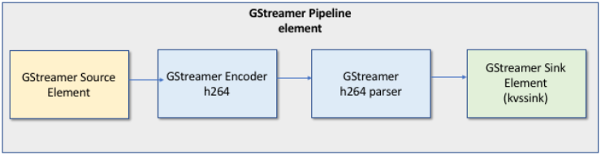

# MJPEG to KVS stream

## Reference

- https://docs.aws.amazon.com/kinesisvideostreams/latest/dg/examples-gstreamer-plugin.html
- https://github.com/awslabs/amazon-kinesis-video-streams-producer-sdk-cpp.git


## MP4 source example

- https://www.pexels.com/download/video/2886841/

## Procedure

1. Convert video into 640x480 MJPEG frames

```
./static-mjpeg.sh <path/to/video/file>.mp4
```
2. Install dependencies and build `kvssink` Gstreamer plugin

```
./build-gst-plugin.sh
```
3. Export path to plugin built and credentials

```
. ./export.sh
```

4. Run 

4.1. standalone kvs-bridge.py example

```
python3 kvs-bridge.py
```

4.2. server-client kvs-bridge example

```
# first start the server

python3 kvs-bridge-server.py
```

```
# then start the client

python3 kvs-bridge-client.py
```

4.3. ESP32 based static jpeg producer

```
# first start the kvs bridge server

python3 kvs-bridge-server.py
```

```
# then configure, build and flash ESP32 firmware
# ref. esp32/tcp_client/README.md 

idf.py -b <port> build flash monitor
```